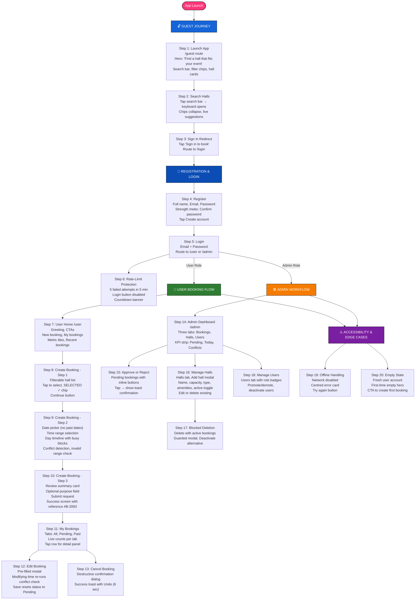

# Hallmaster Enterprise: Complete User Journey & Workflows

This diagram visualizes all 20 user journey steps from SECTION B of the submission report.

## How to Use This Diagram

1. **View in VS Code**: The `.md` file displays the diagram directly in the preview panel
2. **Export to PNG/SVG**: 
   - Use [Mermaid Live Editor](https://mermaid.live) - copy/paste the code
   - VS Code Mermaid extension can export directly
3. **Share**: Include this file in your documentation or presentation

## Diagram Structure

| Section | Color | Steps | Purpose |
|---------|-------|-------|---------|
| Guest Journey | Blue | 1-3 | Public browsing & sign-in |
| Registration & Login | Dark Blue | 4-6 | Account creation & security |
| User Booking Flow | Green | 7-13 | Full booking lifecycle |
| Admin Workflow | Orange | 14-18 | Administrative controls |
| Accessibility & Edge Cases | Purple | 19-20 | Error & empty states |
