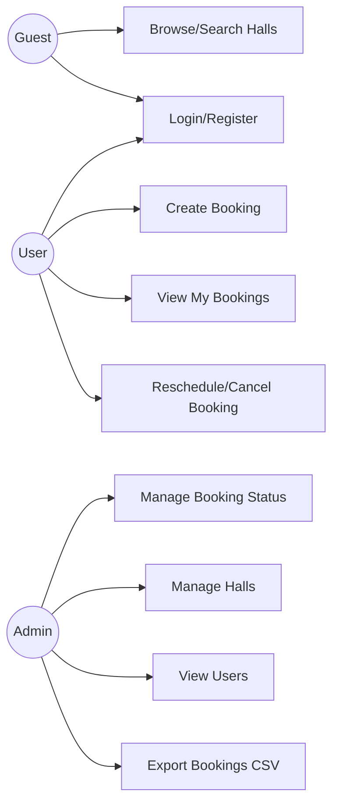
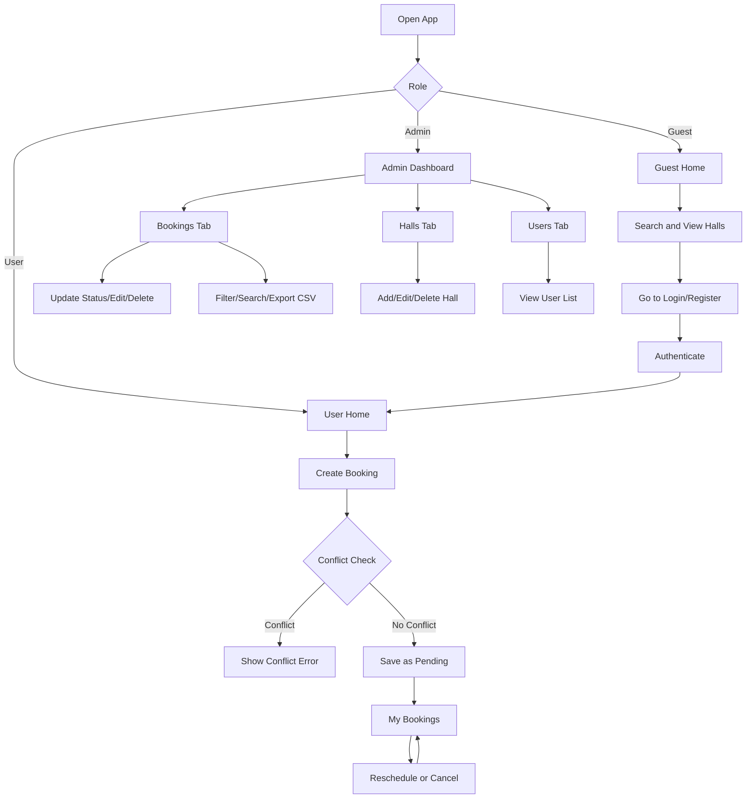

# HallMaster Enterprise
## Use Cases, Flowchart, and Sitemap

Date: 2026-04-19

## 1. Use Case Overview
Actors:
- Guest
- Registered User
- Admin

Guest use cases:
- Browse halls
- Search halls
- Go to login/register

User use cases:
- Register/login
- Create booking
- View my bookings
- Edit/reschedule booking
- Cancel booking

Admin use cases:
- View dashboard metrics
- Manage booking statuses
- Edit/delete booking
- Manage halls (add/edit/delete)
- View users
- Export bookings CSV

## 2. Use Case Diagram (Mermaid)


## 3. Main Flowchart (Mermaid)


## 4. Sitemap (Mermaid)
```mermaid
flowchart LR
  Root[App Root]

  Root --> Guest[/guest]
  Root --> Login[/login]
  Root --> UserHome[/user]
  Root --> BookNew[/booking/new]
  Root --> MyBookings[/booking/my]
  Root --> Admin[/admin]

  Admin --> AdminBookings[Tab: Bookings]
  Admin --> AdminHalls[Tab: Halls]
  Admin --> AdminUsers[Tab: Users]

  MyBookings --> EditDialog[Dialog: Reschedule/Edit]
  AdminBookings --> AdminEditDialog[Dialog: Edit Booking]
  AdminHalls --> HallDialog[Dialog: Add/Edit Hall]
  AdminBookings --> DeleteDialog[Dialog: Delete Confirm]
  AdminHalls --> DeleteHallDialog[Dialog: Delete Confirm]
```

## 5. Rule Annotations for Diagrams
- New booking status = pending.
- Overlap protection checks pending + confirmed statuses.
- Hall deletion blocked if active bookings exist.
- Guest cannot access /user, /booking/new, /booking/my, or /admin.
